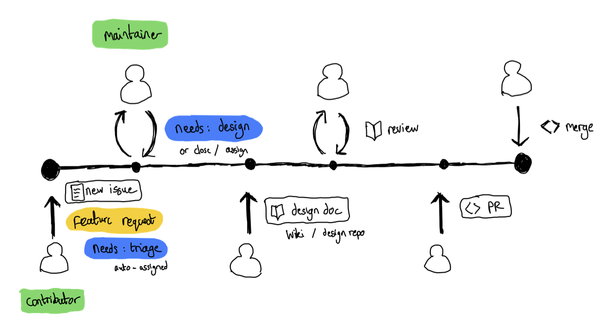

# FlowEHR as an Open-Source project

Open-source projects come in many different flavours, and those who build & maintain them tend to do so in an equal variety of ways; however, there are some common best practices we can draw from to help FlowEHR be successful.

To start with, let's summarise some typical expectations of a "maintained" open-source project:
- There are active maintainers responding to issues, bugs and managing the backlog
- The project will have tagged releases/versions with release notes
- Releases are known to be stable and are validated through CI/CD pipelines and automated testing to ensure they're fit for purpose
- Supported upgrade paths exist from one release to the next
- Contributions are accepted, and are fed back into future releases

It's worth noting that a lot of this is simply best practice for running a project, whether internal or in the open!

## Managing contributions

For MerseyCare and other prospective contributors, we need to have a clear path in place to make shaping the backlog and making key contributions as easy as possible, whilst ensuring direction for the product to best serve its user-base.

As mentioned before, there is no one approach to managing an OSS project and this document will simply reflect my recommendations.

### 1. Who can contribute?

The options:

- Closed contribution (restrict push access to UCLH developers)
- Contribution by invite (only invited orgs/engineers can push)
- Open contribution - the typical model

I would suggest FlowEHR adopts *open contribution*, at least for the foreseeable future. This model is best to encourage adoption and share the load with other contributors to build and maintain the product with the least barriers.

This does mean that FlowEHR's dedicated maintainers will need to stay on top of new feature requests, bugs and PRs. As these could come from anywhere, rigour around management and quality control will be essential.

### 2. How will they contribute?

Some contributors may wish to both raise a request for and develop new features (MerseyCare, the Microsoft team, etc.) and others may wish to do one or the other. The following proposed flow assumes the whole journey from request to merge is done by a single contributor, but some requesters may not develop features themselves, and it's up to maintainers to priotise these and task out the work to other contributors.

> The following flow also applies to bugs

1. Contributor raises an issue in the repo to describe the desired feature
    - On opening the issue, the contributor should be prompted to complete a template to describe the feature
1. On opening, the issue is automatically tagged with a `needs: triage` label to make it easier to filter issues that need maintainer attention
1. The maintainer reviews the issue, removes the traige label, and either:
    - Accepts the issue and deems no design to be necessary (typically smaller features/bug fixes)
    - Accepts the issue and adds a `needs: design` label to indicate that design is required (typically larger features where a better idea of implementation is needed)
    - Prompts the contributor for more information
    - Rejects the issue and closes it
1. If a design is needed, a design document should be added to the issue body under a design heading. We should provide a template for this to capture expected design elements
    - Alternatively bigger designs may be captured in a separate document (in the repo in a `/designs` folder) and linked to from the issue
1. The maintainer reviews the design and either:
    - Accepts the design and removes the `needs: design` label
    - Prompts the contributor for more information/works with them to refine
    - Rejects the design &/or closes the issue
1. The maintainer and contributor work together to break down the feature into smaller stories if neccessary
1. The contributor forks the repo and develops the feature in their own fork
1. The contributor raises a PR to merge the feature into the repo
1. Maintainer(s) review the PR, kick off automated tests if needed, and either:
    - Accept the PR and merge it into the main repo
    - Request changes
    - Reject the PR and close it

### Questions

- Who will be the maintainers? Will this be a team within UCLH? Joint between Merseycare and UCLH (& Msft?)?
    - Who will review new items in the backlog?
    - Who will review designs?
    - Who will review PRs (code)?
    - Who will manage releases?
    - Who will monitor/fix CI/CD environments?
- How many PR reviews will be needed by maintainers?

## Managing the backlog/roadmap

Prioritisation of feature requests and bugs is arguably one of the most critical parts of managing a successful project.

I propose we:
- Create a Project / re-use the `Feature Roadmap` project and create a List view for the backlog, filtered on features/bugs
- We hold a regular planning cadence (e.g. every 2 weeks) to review the backlog (jointly between Merseycare and UCLH in the immediate term) and prioritise
- We use milestones to group features/bugs into releases (e.g. `v0.1.0`, `v0.2.0`, etc.), targeting high priority features/bugs for the next release
- Prioritisation should be informed also by upvoting issues when we have a wider community of users
- Create a board view, grouping by release, to share with other contributors and stakeholders to illustrate the product roadmap

### Questions

- Who will run this meeting? Is there a product owner?
- How often will the cadence be and who should be part of it?
- Will there be active development sprints (UCLH-independent, jointly with MC/Msft)?

> NOTE: we have a number repos, these should all have the same issue templates and should be tagged with the single FlowEHR project to consolidate the backlog into one view

## Managing releases

Releases provide a way to group changes into trackable versions, making it easier for users to understand what's changed and reference back any issues to particular versions.

### 1. How often will we release?

This is a hard question to answer initially and should ideally be driven by user demand for particular features and bug fixes, and will also be dictated by our developer time.

As part of prioritisation as discussed above, we should aim to group features/bugs into releases and target a release every 1-2 months.

### 2. How will we release?

We should leverage [GitHub Releases](https://docs.github.com/en/repositories/releasing-projects-on-github/managing-releases-in-a-repository) to manage this.

When releasing, we will assign a version tag to the release (e.g. `v0.1.0`) and add release notes to the release, which should include a summary of the changes and any upgrade paths from previous versions.

A release should be fully tested against our environments and any upgrade paths should be tested and documented as part of this.

### 3. How will we manage versioning?

We should use [Semantic Versioning](https://semver.org/) to manage versioning. This will help users understand the impact of upgrading to a new version and help us manage backwards compatibility.

### Questions

- Shall we get an initial release out in the next couple of weeks?
- What should be included in the first release?
